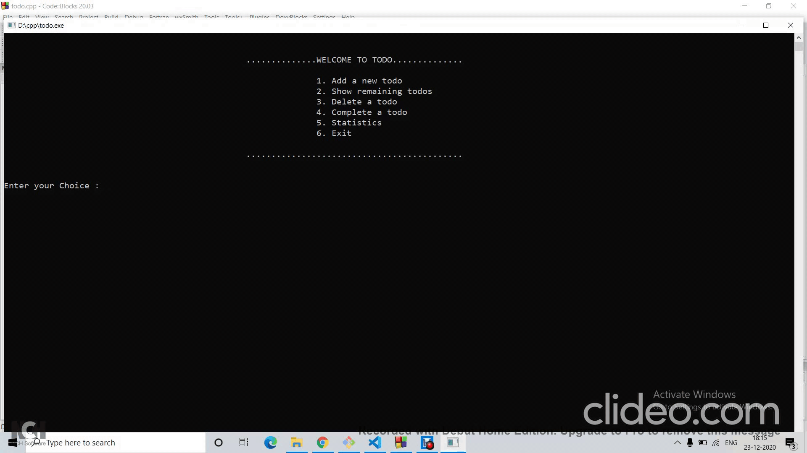

# Todo-List
[](https://gitter.im/FOSS-Cell-GECPKD/Todo-List?utm_source=badge&utm_medium=badge&utm_campaign=pr-badge&utm_content=badge)

[](https://github.com/FOSS-Cell-GECPKD/Todo-List/blob/master/LICENSE)
[](https://github.com/FOSS-Cell-GECPKD/Todo-List/issues)
[](https://gitter.im/FOSS-Cell-GECPKD/Todo-List?utm_source=badge&utm_medium=badge&utm_campaign=pr-badge&utm_content=badge)
## About
This project is designed specially for beginners who has put there first step in opensource contribution. So feel free to contribute.
<br/>


## Features

- Add a new todos
- List all the Pending todos
- Delete a todo item
- Mark a todo item as completed
- Generate a report
- Exit

## Specification
The program should read from and write to a `todo.txt` text file. Each todo item occupies a single line in this file. Here is an example file that has 2 todo items.

```txt
water the plants
change light bulb
```

When a todo item is completed, it should be removed from `todo.txt` and instead added to the `done.txt` text file.


## Usages
- Add e new todo 
```
Use this function to add a new todo item.
```
- Show the remaining todos
```
Use this function to see all the todos that are yet not completed. The most recently added todo should be displayed first.
```
- Delete a todo
```
Use this function to remove a todo item by its number.
Attempting to delete a non-existing todo item should display an erroe message .

"Error : todo #<number of todo>does not exist. Nothing is deleted. "
```
- Complete a todo 
```
Use this function to mark a todo item as completed by its number.
Attempting to mark a non-existed todo item as completed will display an error message.

"Error: todo #<number of todo> does not exist."
```
- Statistics
```
Use this function to see the latest tally of pending and completed todos.

YYYY-mmm-dd Pending : 1  Cpmpleted : 5 
```
- Exit
```
This will simply terminate the program.
```

## SETUP
Clone this repo!

Make a local clone of this repo, so you can work on it from your own computer.

```
git clone https://github.com/FOSS-Cell-GECPKD/Todo-List.git
```
Make your own branch<br/>
Do the changes<br/>
Commit the code with a proper message<br/> 
Push the code to the remote repository. <br/>
create the Pull Request, and wait for merge<br/>
Always make 1 PR at time.<br/> 

## How to Contribute

When you are ready to start work on an issue:

Let us know by leaving a comment on the issue.
Once you are assigned the issue (or once you have claimed the issue) only then proceed to make the Pull Request. This will help avoid multiple PRs pertaining to the same issue.
If you don't see your idea listed, do one of the following:

If your contribution is minor, such as a typo fix, open a pull request.
If your contribution is major, such as a new feature/enhancement, start by opening an issue first. This way, other people can be also involved in the discussion before you do any work.


## Community
Discussions about Todo-List takes place on <a href="https://gitter.im/FOSS-Cell-GECPKD/Todo-List">Gitter chat</a>. Anyone is welcome to join these conversations.


## Contributors
Thanks goes to these wonderful peoples.
<!-- ALL-CONTRIBUTORS-LIST:START - Do not remove or modify this section -->
<!-- prettier-ignore-start -->
<!-- markdownlint-disable -->

<table>
  <tr>
    <td align="center"><a href="https://rishikeshrajrxl.github.io/#/"><br /><sub><b>Rishikesh Raj</b></sub></a><br /><a href="#" title="Content">🖋</a> <a href="https://github.com/FOSS-Cell-GECPKD/Todo-List" title="Documentation">📖</a> <a href="https://github.com/Rishikeshrajrxl" title="Code">💻</a></td>
  </tr>
  </table>
