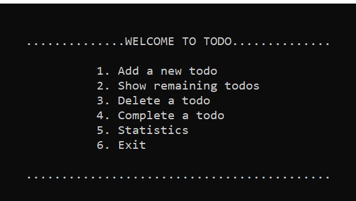

# Todo-List
[](https://gitter.im/FOSS-Cell-GECPKD/Todo-List?utm_source=badge&utm_medium=badge&utm_campaign=pr-badge&utm_content=badge)

[](https://github.com/FOSS-Cell-GECPKD/Todo-List/blob/master/LICENSE)
[](https://github.com/FOSS-Cell-GECPKD/Todo-List/issues)
[](https://gitter.im/FOSS-Cell-GECPKD/Todo-List?utm_source=badge&utm_medium=badge&utm_campaign=pr-badge&utm_content=badge)
## About
This project is designed specially for beginners who has put there first step in opensource contribution. So feel free to contribute.
<br/>

## Features
- Help
- List all the Pending todos
- Add a new todos
- Delete a todo item
- Mark a todo item as completed
- Generate a report

## SETUP
Clone this repo!

Make a local clone of this repo, so you can work on it from your own computer.

```
git clone https://github.com/FOSS-Cell-GECPKD/Todo-List.git
```
Make your own branch<br/>
Do the changes<br/>
Commit the code with a proper message<br/> 
Push the code to the remote repository. <br/>
create the Pull Request, and wait for merge<br/>
Always make 1 PR at time.<br/> 

## Community
Discussions about Todo-List takes place on <a href="https://gitter.im/FOSS-Cell-GECPKD/Todo-List">Gitter chat</a>. Anyone is welcome to join these conversations.


## Contributors
Thanks goes to these wonderful peoples.
<!-- ALL-CONTRIBUTORS-LIST:START - Do not remove or modify this section -->
<!-- prettier-ignore-start -->
<!-- markdownlint-disable -->

<table>
  <tr>
    <td align="center"><a href="https://rishikeshrajrxl.github.io/#/"><br /><sub><b>Rishikesh Raj</b></sub></a><br /><a href="#" title="Content">🖋</a> <a href="https://github.com/FOSS-Cell-GECPKD/Todo-List" title="Documentation">📖</a> <a href="https://github.com/Rishikeshrajrxl" title="Code">💻</a></td>
  </tr>
  </table>
